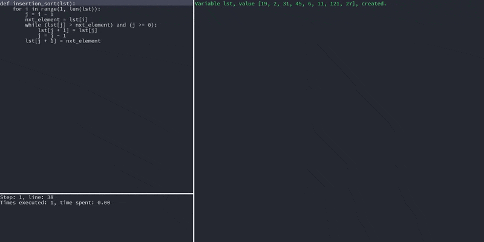

# TinyDebug
TinyDebug is a Python tool used to create simple, shareable videos of step-by-step execution of code, just like this one:



## Installation
Use the `pip` package manager to install TinyDebug
```shell script
pip install tinydebug
```
Then, you can run it as a command-line tool:
```shell script
tinydebug --help
```
if that doesn't work, try running ``python -m tinydebug --help``.

## Contributing
Want to contribute? That's awesome! Have a look at the issues page, and pick something to work on.
Please comment on an issue to let me know you're working on it, so that I can help you along the way :)

Found a bug, some typo, or want to suggest a cool new feature? Open up an issue, we'll discuss it and start working on it!
And if you fix a small bug or want to make a small change that doesn't have an issue already, just send a pull request! Pull requests are always welcome.

## License
This repository is maintained by AlephZero, and was created during Google Code-In 2019.  
The code is licensed under the MIT license.
